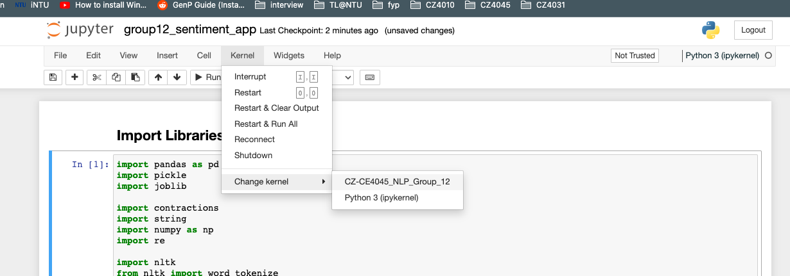
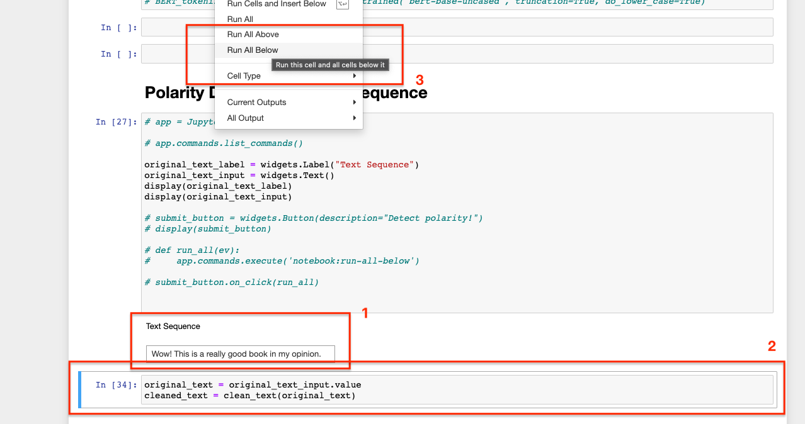

# CZ4045 Natural Language Processing Project - Group 12

## Sentiment Application Installation Guide
1. Navigate to the project root directory "CZ-CE4045_NLP_Group_12/"

2. Install dependencies in listed in Pipfile using <b>pipenv</b> and activate virtual environment.
<pre><code> pipenv shell   pipenv install </code></pre>

3. Run "jupyter notebook" and open "group12_sentiment_app.ipynb"
<pre><code>jupyter notebook</code></pre>

4. Switch Jupyter kernel to the activated virtual environment.

5. Run all notebook cells for the first time.

6. Input your desired text sequence, select the next cell and run all remaining cells to view the results of polarity detection by the trained models.

## Google BERT Dependencies Issue
Some dependencies that are required by the Google BERT model are not able to be installed in a <b>pipenv</b> virtual environment, therefore we ommited it in this application.